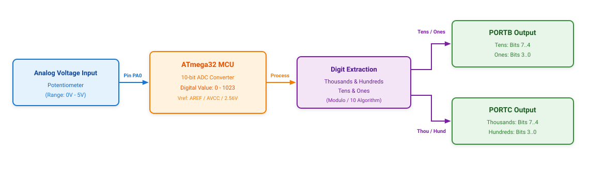

# Project ATmega32_ADC

## 1. Overview & Working Principle
* **Objective**: Read analog voltage from a potentiometer and display the 4-digit reading on a 7-segment display.
* **Operation**:
  1. Analog voltage from the potentiometer is fed into pin **PA0** (ADC0) of the **ATmega32** microcontroller.
  2. The internal 10-bit ADC converts the analog voltage into a digital integer from `0` to `1023`.
  3. The microcontroller extracts the 4 individual decimal digits (Thousands, Hundreds, Tens, Ones).
  4. The decoded multiplexed output is written to 2 I/O ports:
     * **PORTB**: Outputs Tens (bits 7..4) and Ones (bits 3..0).
     * **PORTC**: Outputs Thousands (bits 7..4) and Hundreds (bits 3..0).

## 2. System Block Diagram

*Original design file*: [diagram.drawio](diagram.drawio)

## 3. Directory Structure
* `Source_code/main.cpp`: C/C++ firmware source code for ATmega32.
* `Simulation/Single_ADC.pdsprj`: Circuit simulation project for Proteus.
* `Power_point/251107_AVR_ADC.pptx`: Presentation slides explaining AVR ADC fundamentals.
