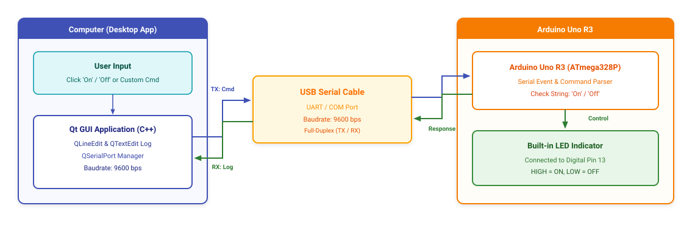

# Project Qt_Arduino_Com

## 1. Overview & Working Principle
* **Objective**: Bidirectional serial communication between a Qt 6 Desktop application and an Arduino Uno R3 to control a hardware LED.
* **Operation**:
  1. The user inputs `"On"` or `"Off"` in the **Qt GUI** application and clicks Send.
  2. The desktop app transmits the command string over a **USB Serial connection (COM Port)** at 9600 baud.
  3. The **Arduino Uno R3** receives and processes the incoming string:
     * `"On"`: Powers the built-in LED on pin 13 (`digitalWrite(LEDIN, HIGH)`).
     * `"Off"`: Turns off the LED on pin 13 (`digitalWrite(LEDIN, LOW)`).
  4. Arduino Uno R3 sends an acknowledgment string back (`"Data To Application LED IS ON / OFF"`) to display on the Qt QTextEdit log console.

## 2. System Block Diagram

*Original design file*: [diagram.drawio](diagram.drawio)

## 3. Directory Structure
* `Arduino_With_Qt_GUI/Arduino_With_Qt_GUI.ino`: Arduino sketch handling Serial communication and LED switching.
* `Qt_GUI_with_Arduino/`: Qt Widgets C++ project (`.pro`, `.ui`, `main.cpp`, `mainwindow.cpp`).
* `Qt_Arduino_Com.mp4`: Recorded video demonstration of the working system.
