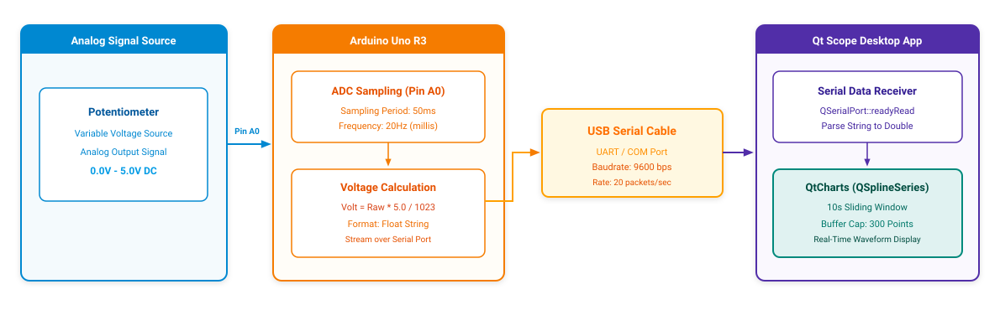

# Project Qt_Serial_Scope

## 1. Overview & Working Principle
* **Objective**: Real-time potentiometer ADC voltage oscilloscope plotting incoming Arduino Uno R3 serial data on a Qt Charts interface.
* **Operation**:
  1. The **Arduino Uno R3** samples analog voltage from a potentiometer at pin **A0** at a periodic **50ms interval** (20Hz).
  2. Converts the 10-bit raw ADC reading to standard voltage ($0.0V - 5.0V$) and transmits the float string over USB Serial.
  3. The **Qt** desktop application captures incoming data via the `readyRead` signal.
  4. The **QtCharts** library (`QSplineSeries`) plots the voltage values onto a smooth curve and dynamically slides a 10-second viewing window (Sliding Window, up to 300 data points).

## 2. System Block Diagram

*Original design file*: [diagram.drawio](diagram.drawio)

## 3. Directory Structure
* `ADC_Arduino/ADC_Arduino.ino`: Arduino sketch sampling pin A0 and streaming serial data every 50ms.
* `ADC_Sqline_Chart/`: Qt Charts C++ project for real-time oscilloscope visualization.
* `Qt_Serial_Scope.mp4`: Recorded video demonstration of the live real-time graph.
